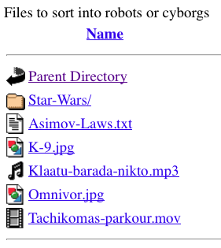
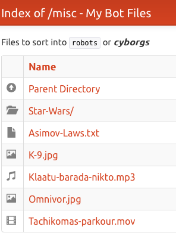

Autoindex-Strapdown Read-Me
---------------------------

[Autoindex-Strapdown] enhances Apache's [mod_autoindex] directory listings with
[Markdown] README and HEADER files rendered by [Strapdown.js]. Setup GitHub-like
directory documentation with just Apache!

 
 **&#x276e; Before and After &#x276f; &#x276f;**
 

### Quick Start

**Simply copy the following into a directory's .htaccess file.
Then add a README.md or HEADER.md files and enjoy:**

```
# Apache Autoindex Directives
Options Indexes
IndexOptions FancyIndexing HTMLTable SuppressRules
IndexOptions IconsAreLinks ScanHTMLTitles NameWidth=* DescriptionWidth=*

# Autoindex-Strapdown Directives
AddType text/plain .md
HeaderName HEADER.md
ReadmeName README.md

# Customize by setting theme and title
IndexHeadInsert "<script>conf = {theme: 'bootstrap', title: ''};</script> \
<script src='http://ais.habilis.net/autoindex_strapdown.js'></script> \
<link rel='stylesheet' href='http://ais.habilis.net/autoindex_strapdown.css'>"

# Icons using Bootstrap's Glyphicon set
DefaultIcon http://ais.habilis.net/icons/glyphicon-file.svg
AddIcon http://ais.habilis.net/icons/blank.svg ^^BLANKICON^^
AddIcon http://ais.habilis.net/icons/glyphicon-folder-open.svg ^^DIRECTORY^^
AddIcon http://ais.habilis.net/icons/glyphicon-circle-arrow-up.svg ..
AddIconByType (TXT,http://ais.habilis.net/icons/glyphicon-file.svg) text/*
AddIconByType (IMG,http://ais.habilis.net/icons/glyphicon-picture.svg) image/*
AddIconByType (SND,http://ais.habilis.net/icons/glyphicon-music.svg) audio/*
AddIconByType (VID,http://ais.habilis.net/icons/glyphicon-film.svg) video/*
```

Customize by setting the `theme` or `title` configuration parameter on the first line of
the `IndexHeadInsert` directive. For example:

`IndexHeadInsert "<script>conf = {theme: 'cyborg', title: 'My Robot Pics'};</script> \`

See the list of [themes available from Strapdown.js][Strapdown.js].

### Self-Hosting

For simplicity, the example above is hosted at `ais.habilis.net`. To install on your
own host, download or git-clone Autoindex-Strapdown, and adjust the htaccess directives
to point at a local URLs for the Javascript, CSS and icons. Add the extra conf option
`stapdown` to self-host Strapdown. I.e.:

`conf = {theme: 'bootstrap', title: '', strapdown: '/sd/strapdown.js'}`

For a concrete example, see the [htaccess-selfhost](htaccess-selfhost) file which expects
Autoindex-Strapdown to be installed on the host at the URL `/autoindex_strapdown/`.

### Background

Since time immemorial, the Apache web server has had the ability to serve up directory
listings (indexes), optionally augmented with text or HTML read-me and header files.
GitHub partially emulates Apache's auto-indexes with READMEs, but enhances it by adding
Markdown formatting -- the prefect compromise between plain text and HTML.

In a sense, Autoindex-Strapdown is an attempt to backport GitHub's enhanced emulation of
Apache mod_autoindex back to Apache.

[Autoindex-Strapdown]: http://ais.habilis.net
[mod_autoindex]: http://httpd.apache.org/docs/2.2/mod/mod_autoindex.html
[Markdown]: https://daringfireball.net/projects/markdown/
[Strapdown.js]: http://strapdownjs.com
